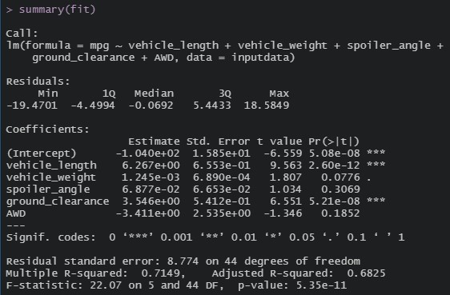
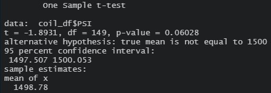
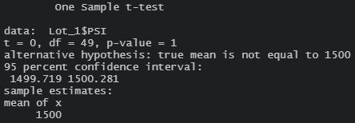
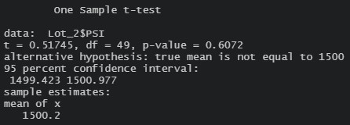
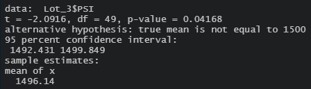

# MechaCar_Statistical_Analysis

## Linear Regression to Predict MPG

- Which variables/coefficients provided a non-random amount of variance to the mpg values in the dataset?

  - The variables which provide a non-random amount of variance would be the vehicle length and ground clearance variables.  If you look at the below summary you will see Pr(>|t|) values of 2.60e-12 and 5.21e-08 respectively.  In general for things to be considered statistically significant we look for the p-values cutoff of 0.05.  These two variables with their extremely low values are both well below 0.05.  Thus these 2 variable have a significant impact on mpg.

  - On the other hand, the other variables vehicle weight , spoiler angle, and AWD do contribute significant amounts of non-random variance.  If you look at their Pr(>|t|) values you will see that they are 0.0776, 0.3069, and 0.1852 which are all well above the 0.05 cutoff.  Thus, these variables are unlikely to have a significant impact on mpg.

- Is the slope of the linear model considered to be zero? Why or why not?

  - With an R-squared value of 0.7149 the data makes a pretty strong fit for a linear model.  Since the value of R-squared is so close to one, it is a reasonable assumption that the slope is non-zero.  A model with an R-squared value close to 0 would indicate that the best fit line is horizontal and that is not the case here.

- Does this linear model predict mpg of MechaCar prototypes effectively? Why or why not? 

  - Not really.  Although this model had an adjusted R-squared value of 0.6825 I think that this model would need to be tweaked to be more useful as a predictor.  My first recommendation would be to drop the spoiler angle data entirely.  Does spoiler angle have an impact on mpg?  Sure.  It is statistically significant?  Not really.  The data would be cleaner without it.

  - My 2nd recommendation is to drop the AWD column as well.  This is binary data and thus isn't really helping our model all that much.  What I would do instead is to run a regression on AWD and non-AWD vehicles separately and work with two models.

### MPG Prediction Results:

## Summary Statistics on Suspension Coils
- The design specifications for the MechaCar suspension coils dictate that the variance of the suspension coils must not exceed 100 pounds per square inch. Does the current manufacturing data meet this design specification for all manufacturing lots in total and each lot individually? Why or why not?

Looking a the total summary data, the variance for the PSI is 62.29356 for all 3 lots combined.  So if you just look at the total data, the company does appear to be meeting the design specificiations.  On the other hand, if you look instead at the variance at a lot by lot basis you will notice that lot one is doing a fantastic job with a variance of only 0.9795918.  Lot 2 is also doing fairly good with a variance of only 7.4693878.  Lot 3 however, appears to be having some issues as their variance is at 170.2861224 which puts them over the design specifications.

### Total Summary

### Lot Summary

## T-Tests on Suspension Coils
Looking at the T-Test on the overall data we see that there is a p-value of 0.06028, which is above the typical p-value cutoff of 0.05.  Thus we cannot reject the null hypothesis.  Thus we can conclude that there is no significant difference in the overall mean PSI of the 3 lots from 1500.

Looking at the T-Test for lot 1 we see that there is a p-value of 1.  With a p-value this high we definately do not reject the null hypothesis and it is reasonable for us to conclude that the mean PSI value of this lot is almost exactly 1500.

When we look at the T-Test done on lot 2 we see that it had a p-value of 0.6072.  With a p-value this high we cannot reject the null hypothesis and the mean PSI here is very close to the population value of 1500.

Lastly, looking at the T-Test for lot 3 we see that it had a p-value of 0.04168.  Since this is below the cutoff of 0.05, we can reject the null hypothesis here and conclude with reasonable certainty that the mean PSI for this lot is below 1500.  The given 95% confidence interval suggests that the true mean is between 1492.431 and 1499.849 for this lot. 

### Total T-Test

### Lot 1 T-Test

### Lot 2 T-Test

### Lot 3 T-Test

## Study Design: MechaCar vs Competition
Several features that I believe are important when buying a car are the safety rating, fuel economy (mpg), hp.  People tend to want vehicles with high mpg, high safety, and high hp.  So what we could do is to compare those three statistics from the MechaCar brand to their competitors by using T-tests.  We could make the null hypothesis that there is no significant difference between brands for the given statistic and the alternative hypothesis is that there is a difference between brands.  We would then need to go collect data from our competitors brands in order to make the comparisons and perform the T-tests.  In order to produce the best results possible, we would need to collect data on all competing vehicles.
